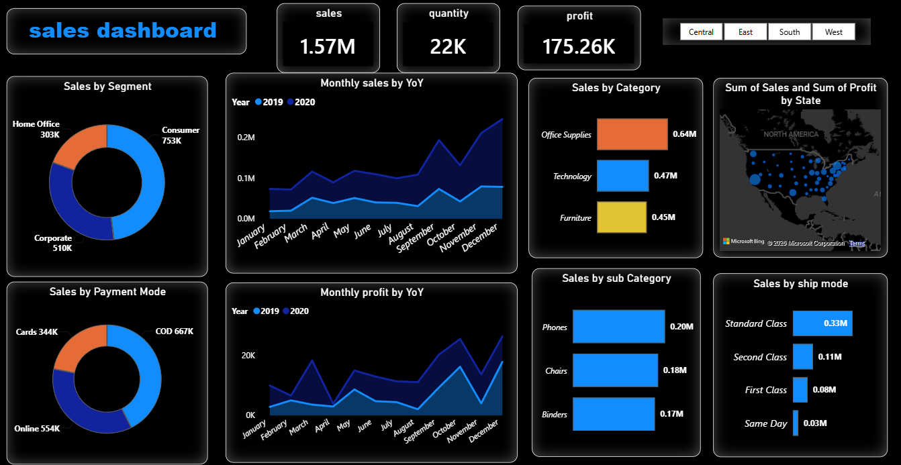

# E-Commerce Sales & Performance Dashboard

## 📊 Dashboard Preview

## 🎯 Project Overview
An interactive, dark-themed Power BI dashboard built to transform raw transactional e-commerce records into actionable business insights. It tracks core retail metrics and delivers dynamic visual reporting.

## 🛠️ Tech Stack & Skills
* **Visualization Tool:** Power BI Desktop
* **Features Used:** DAX Measures, Interactive Modeling, Page Filters

## 📈 Key Insights Tracked
* **High-Level KPIs:** Monitored **$1.57M in Total Sales**, **22K in Quantity**, and **$175.26K in Profit**.
* **Trend Analysis:** Engineered Year-over-Year (YoY) line charts to isolate seasonal performance and spikes.
* **Granular Breakdown:** Built cross-filtering capabilities across geographical states, payment modes (COD vs. Online), and consumer segments.
